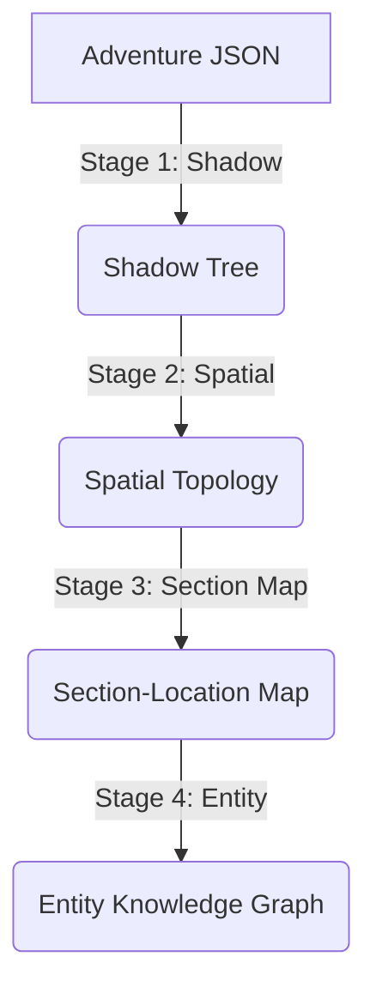

# LoreWeaver

An automated pipeline to convert D&D module JSON into Knowledge Graphs for GraphRAG, powering an AI Dungeon Master.

## Installation

See `pyproject.toml` for dependencies.

```bash
# Install core dependencies (for data mining)
pip install -e .

# Install with frontend dependencies (for visualization and GraphRAG)
pip install -e .[ui]
```

Configure environment variables in `.env`:

```bash
# Required: LLM API configuration
OPENAI_API_KEY=your_api_key_here
OPENAI_BASE_URL=https://api.openai.com/v1  # Or your vLLM endpoint
LLM_MODEL=deepseek-chat  # Model name

# Optional: Concurrency control
LLM_MAX_CONCURRENT=50  # Default: 50
```

## Pipeline Overview

LoreWeaver uses a **spatial-first** pipeline (`src/main.py`) designed for large models (GPT-4o, Claude 3.5, etc.). This pipeline prioritizes understanding the physical structure of the dungeon/world before populating it with entities.



### Stages

1. **Shadow (`shadow`)**: Builds a "Shadow Tree" from the raw Adventure JSON. This creates a hierarchical skeleton of the document structure without heavy processing.
2. **Spatial (`spatial`)**: analysis the text to extract a Spatial Topology Graph. It identifies locations (Rooms, Areas) and their connections (Exits, Passages).
3. **Section Map (`section-map`)**: Maps narrative text sections to the identified spatial locations, ensuring that entities found in the text are placed in the correct physical context.
4. **Entity (`entity`)**: Extracts entities (Monsters, NPCs, Items) and their relationships, populating the graph within the established spatial framework.

## File Structure

```text
.
├── data/                   # Input data (Adventure JSONs)
├── src/                    # Source code
│   ├── builder/            # Graph construction logic
│   ├── llm/                # LLM processing modules (Entity, Spatial)
│   ├── graphRAG/           # Graph Retrieval-Augmented Generation logic
│   └── main.py             # Pipeline entry point
├── frontend/               # Streamlit visualization app
├── output/                 # Generated graphs
├── pyproject.toml          # Project configuration and dependencies
└── README.md               # This file
```

## Data Sources

The system input data is sourced from the open-source website [5e.tools](https://5e.tools/). The data format is compatible with the 5e-tools JSON data structure.
Input files are located in `data/` folder (e.g., `data/adventure-dosi.json`).
See `data/data overview.md` for detailed schema information.

Each module contains:

- **Sections/Entries**: Hierarchical text content.
- **Tags**: Special references like `{@creature Goblin}`, `{@item Potion}`, which serve as seed data for extraction.

## Usage

### 1. Data Mining Pipeline

Run the pipeline to process an adventure and generate a knowledge graph.

```bash
# Run the full pipeline
python -m src.main --stage all

# Run specific stages (useful for debugging or partial updates)
python -m src.main --stage spatial --stage section-map

# Force rerun (ignore cache)
python -m src.main --stage all --force
```

**Advanced Code Usage:**

```bash
# Specify input file and output directory
python -m src.main --input data/adventure-lmop.json
```

### 2. Frontend & GraphRAG

Explore the generated graph and run RAG queries using the Streamlit frontend.

```bash
python -m streamlit run frontend/app.py
```

The frontend provides:

- **Pipeline Control**: GUI to trigger the main pipeline.
- **Graph Visualization**: Interactive 2D/3D graph explorer (using PyVis).
- **RAG Chat**: Interface to chat with the knowledge base (requires `networkx` and produced graph data).
